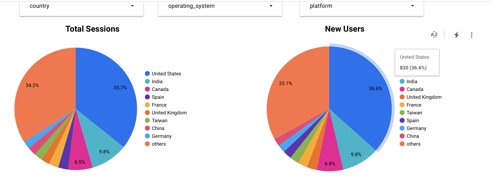
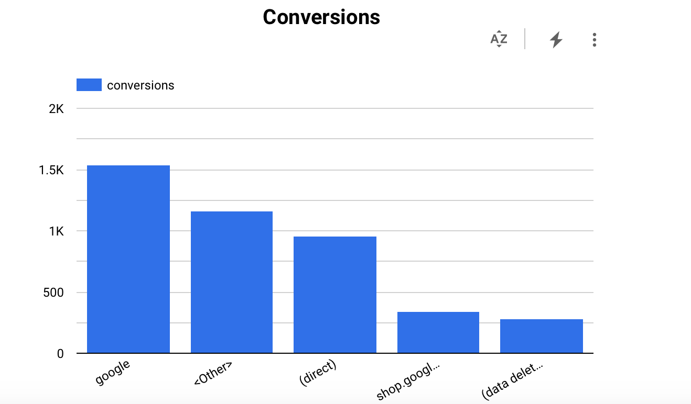

Welcome to your new dbt project!

### Using the starter project

Try running the following commands:
- dbt run
- dbt test

### Resources:
- Learn more about dbt [in the docs](https://docs.getdbt.com/docs/introduction)
- Check out [Discourse](https://discourse.getdbt.com/) for commonly asked questions and answers
- Join the [dbt community](http://community.getbdt.com/) to learn from other analytics engineers
- Find [dbt events](https://events.getdbt.com) near you
- Check out [the blog](https://blog.getdbt.com/) for the latest news on dbt's development and best practices

### Final dash

https://lookerstudio.google.com/reporting/0aa5b31e-c302-4e7a-8d26-805641ac17c0/page/7NvYD